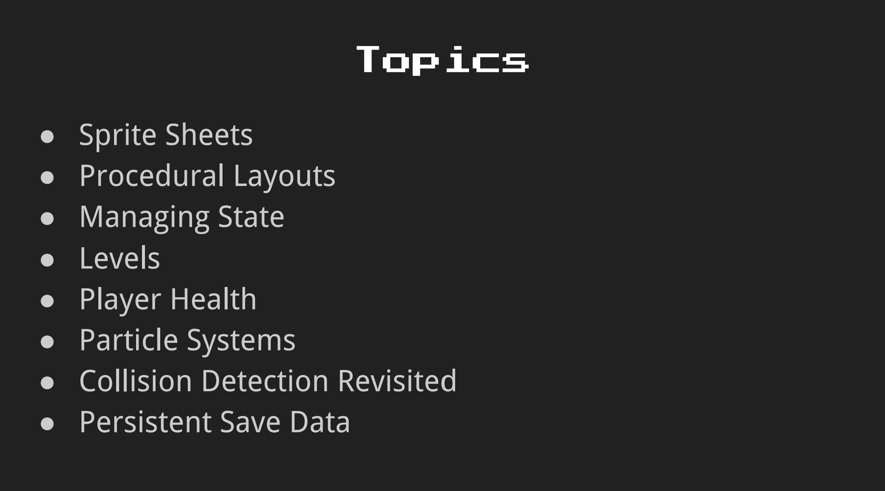
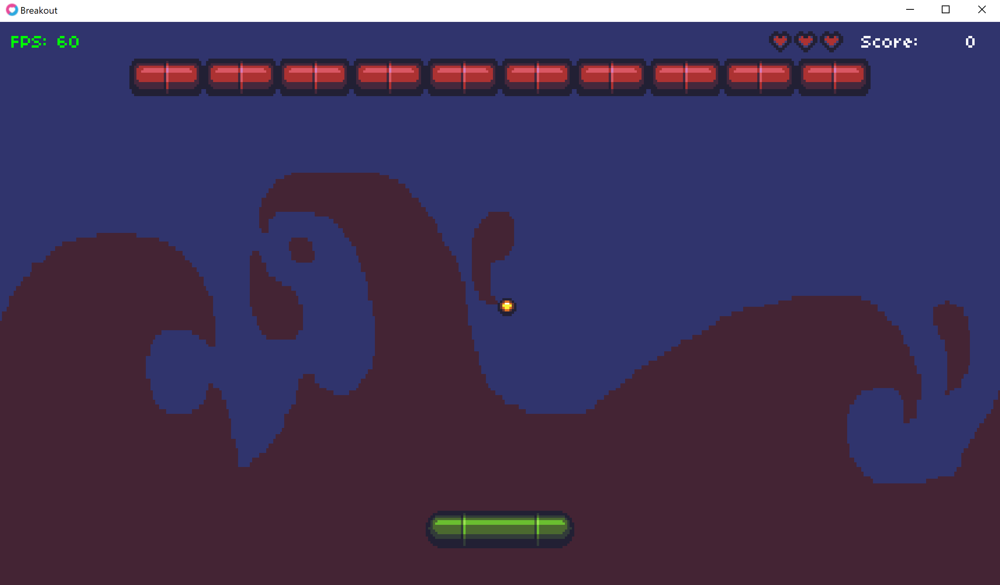

# Breakout

[Lecture](https://learning.edx.org/course/course-v1:HarvardX+CS50G+Games/block-v1:HarvardX+CS50G+Games+type@sequential+block@ca386adaf12344b2b3f8760dbf1f5e0e/block-v1:HarvardX+CS50G+Games+type@vertical+block@ec9b73e83f134172961bd863f41faeda),
[Code](https://github.com/games50/breakout)

