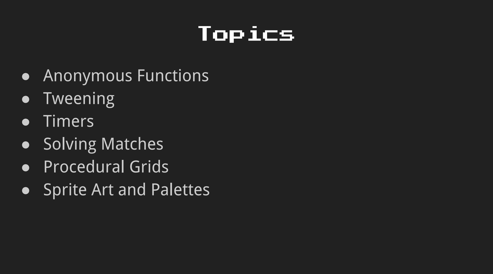
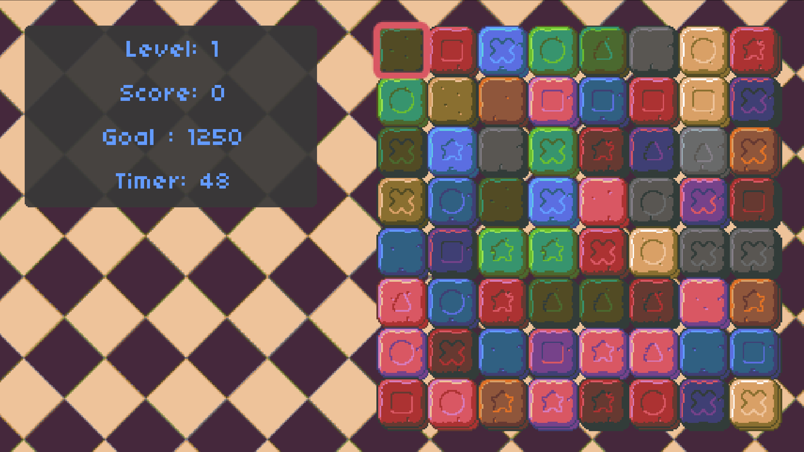

# Match 3

[Lecture](https://learning.edx.org/course/course-v1:HarvardX+CS50G+Games/block-v1:HarvardX+CS50G+Games+type@sequential+block@242fb35f1ce744a99b3cff3725a211e1/block-v1:HarvardX+CS50G+Games+type@vertical+block@1f2e216598794b07b0ed5639345975a0),
[Code](https://github.com/games50/match3)

