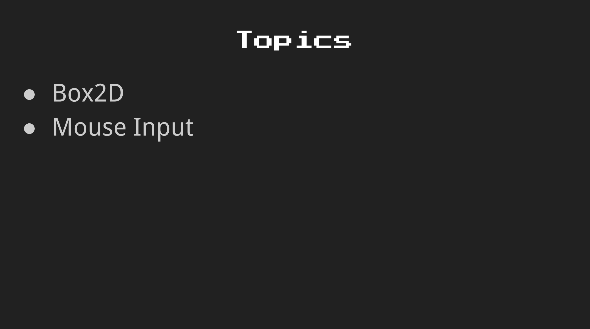
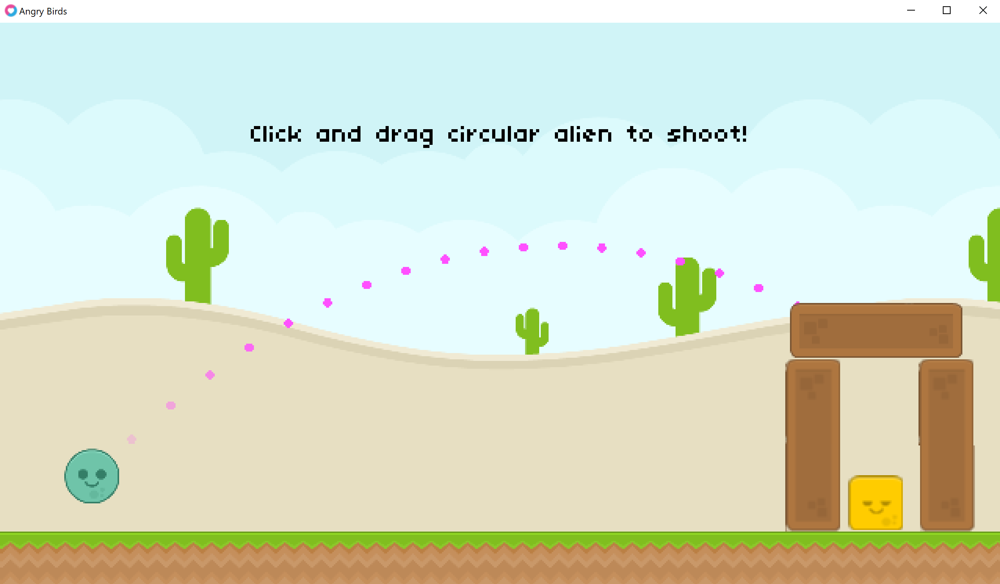

# Angry Birds

[Lecture](https://learning.edx.org/course/course-v1:HarvardX+CS50G+Games/block-v1:HarvardX+CS50G+Games+type@sequential+block@d9f4a3b8b066409ca7e9d9882ee6aec5/block-v1:HarvardX+CS50G+Games+type@vertical+block@852e32afaffd4ff290d5e41c00698bb6),
[Code](https://github.com/games50/angrybirds)

