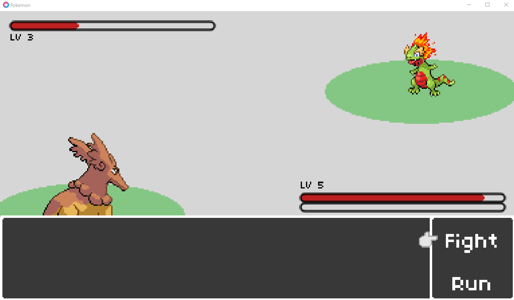

# Pokemon

[Lecture](https://learning.edx.org/course/course-v1:HarvardX+CS50G+Games/block-v1:HarvardX+CS50G+Games+type@sequential+block@03d5f575d06e43269d7c3adf2c45f73e/block-v1:HarvardX+CS50G+Games+type@vertical+block@74ed7d9ed73744578e5b703d48ee4b91),
[Code](https://github.com/games50/pokemon)

