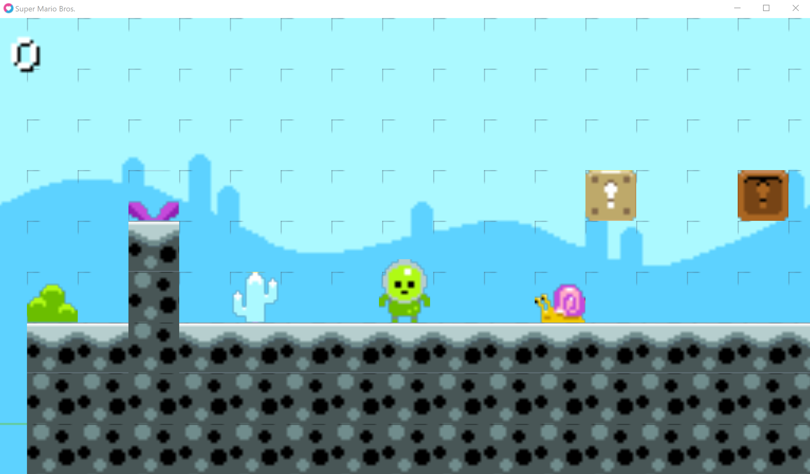

# Mario

[Lecture](https://learning.edx.org/course/course-v1:HarvardX+CS50G+Games/block-v1:HarvardX+CS50G+Games+type@sequential+block@adb271e8920b4280909bb6a75be114cd/block-v1:HarvardX+CS50G+Games+type@vertical+block@995fe192231240639e67a8bacb8d93eb),
[Code](https://github.com/games50/mario)

